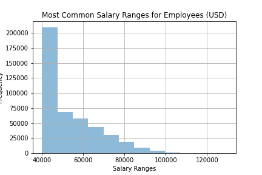

# sql-challenge
Design the tables to hold data in the CSVs, import the CSVs into a SQL database, and answer questions about the data.

**Objective:** research project task as a data engineer at Pewlett Hackard regarding employees of the corporation from the 1980s and 1990s. There are three major tasks:

- Data Modeling: inspect the CSVs and sketch out an ERD of the tables.
- Data Engineering: use the information to create a table schema for each of the six CSV files. Specify data types, primary keys, foreign keys, and other constraints.
- Data Analysis: create a SQL file with queries to find out about:
    - A SQL file of queries for the employee database of the following queries below:

    - List of employee details regarding: employee number, last name, first name, gender, and salary.

    - List of employees who were hired in 1986.

    - List of manager details of each department with the following information: department number, department name, the manager's employee number, last name, first name, and start and end employment dates.

    - List of employee details for each department with the following information: employee number, last name, first name, and department name.

    - List of all employees whose first name is "Hercules" and last names begin with "B."

    - List of all employees in the Sales department, including their employee number, last name, first name, and department name.

    - List of all employees in the Sales and Development departments, including their employee number, last name, first name, and department name.

    - In descending order, list of the frequency count of employee last names, i.e., how many employees share each last name.

**Bonus:**  create histograms to visualize the most common salary ranges by title and by all employees.

